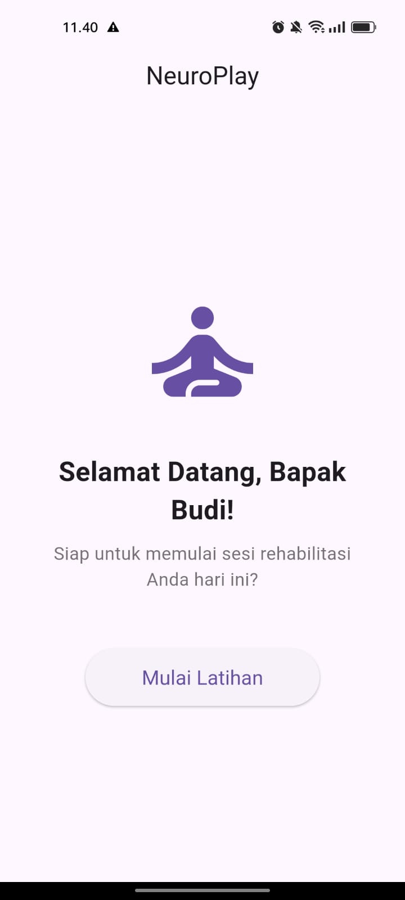

# NeuroPlay: AI-Powered Stroke Rehabilitation  rehabilitación


[Exercise](assets/elbow_elevation.gif)

**NeuroPlay** adalah prototipe aplikasi *mobile* terapi digital berbasis Kecerdasan Buatan (AI) untuk rehabilitasi pasca-stroke. Proyek ini dibuat untuk **ID Healthcare Hackathon**.

## 📖 Latar Belakang Masalah

Stroke adalah salah satu penyebab utama kecacatan di Indonesia. Proses rehabilitasi konvensional seringkali monoton, sulit diakses, dan kurang memotivasi, yang menyebabkan tingkat kepatuhan pasien rendah. NeuroPlay hadir sebagai solusi untuk membuat proses rehabilitasi lebih menarik, terukur, dan dapat diakses dari mana saja.

## ✨ Solusi Kami

NeuroPlay mengubah latihan fisioterapi yang membosankan menjadi permainan interaktif. Dengan memanfaatkan kamera ponsel, aplikasi ini menggunakan AI untuk menganalisis gerakan pengguna secara *real-time*, memberikan *feedback* langsung, dan melacak kemajuan mereka.

## 🚀 Fitur Utama (Hackathon PoC)

* **Deteksi Pose Real-Time:** Menggunakan model AI **MoveNet (TFLite)** untuk mendeteksi 17 titik sendi utama tubuh manusia melalui kamera.
* **Overlay Skeleton Virtual:** Menggambar "kerangka" virtual di atas tubuh pengguna untuk visualisasi gerakan.
* **Latihan Interaktif:** Implementasi satu modul latihan ("Elevasi Siku") dengan logika gamifikasi.
* **Penghitung Repetisi Otomatis:** Sistem secara cerdas menghitung repetisi yang benar berdasarkan sudut sendi yang akurat.
* **Feedback Real-Time:** Pengguna mendapatkan *feedback* visual (perubahan warna) dan audio ("ting!") saat melakukan gerakan dengan benar.
* **Alur Aplikasi Lengkap:** Dari menu utama, sesi latihan dengan *countdown*, hingga halaman hasil akhir.

## 🛠️ Teknologi yang Digunakan

* **Framework:** Flutter
* **State Management:** GetX
* **Computer Vision:** TensorFlow Lite (`tflite_flutter`)
* **Akses Perangkat:** `camera`, `permission_handler`
* **Pemrosesan Gambar:** `image`
* **Audio:** `audioplayers`

## ⚙️ Cara Menjalankan Proyek

1.  Pastikan Anda sudah meng-install [Flutter SDK](https://flutter.dev/docs/get-started/install).
2.  Clone repositori ini:
    ```bash
    git clone https://github.com/IlhamRichie/NeuroPlay-App.git
    ```
3.  Masuk ke direktori proyek:
    ```bash
    cd neuroplay
    ```
4.  Lakukan pembersihan dan instalasi dependensi:
    ```bash
    flutter clean
    flutter pub get
    ```
5.  Jalankan aplikasi di perangkat fisik (dianjurkan) atau emulator:
    ```bash
    flutter run
    ```

## 🖼️ Tampilan Aplikasi

| Halaman Utama | Sesi Latihan | Halaman Hasil |
| :-----------: | :----------: | :-----------: |
|  |  |  |

## 👥 Tim Kami

* **M. Ilham Rigan Agachi** - AI & Flutter Development
* **Nanda Fridiani Bintoro** - Research & Product
* **Nayarana Eka Candra** - Research & Product
* **Putri Ajeng Imamah** - Data & Logic

---
*Proyek ini didedikasikan untuk meningkatkan kualitas hidup para pejuang pasca-stroke di Indonesia.*